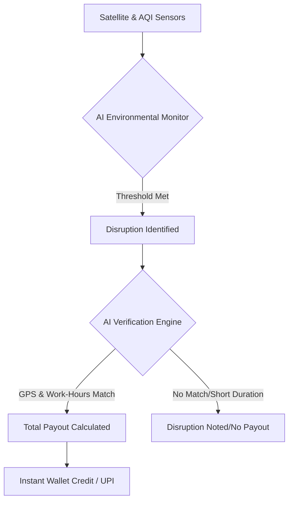

# ShieldPath: AI-Powered Parametric Insurance for India’s Gig Economy

## 📌 Problem Statement: The Earnings Gap
India's platform-based delivery partners (Zomato, Swiggy, Zepto, etc.) are the backbone of the digital economy. However, external disruptions like **extreme weather, severe pollution, and sudden curfews** can slash their working hours, causing a **20-30% loss in monthly earnings**. Currently, these workers have zero income protection. When disruptions occur, they bear the full financial blow with no safety net.

## 🛡️ The Solution: ShieldPath
**ShieldPath** is an AI-enabled parametric insurance platform that safeguards gig workers specifically against **Income Loss**. By leveraging real-time satellite data and AI, we provide an automated, transparent, and friction-less safety net.

---

## 🏗️ Core Architecture & Requirements

### 1. **Parametric "Zero-Manual" Triggers**
Unlike traditional insurance, our platform is **Parametric**. Claims are not filed; they are triggered. 
- **Satellite Integration**: Constant monitoring via Open-Meteo APIs for Heat, Rain, and AQI.
- **Threshold Logic**: Claims trigger instantly when environment conditions (e.g., Rainfall > 50mm/hr) remain active for >3 hours in a partner's primary zone.

### 2. **Intelligent Fraud Detection**
To ensure payouts are legitimate, our AI engine verifies:
- **GPS Correlation**: Confirms the partner was active in the affected zone during the disruption.
- **Working Hour Sync**: Payouts only trigger if the disruption occurs during the user's registered delivery shifts.
- **Automated Verification**: AI checks satellite history against partner GPS logs to prevent manual claim fraud.

### 3. **Weekly Financial Model (Gig-Aligned)**
Aligned with the typical payout cycle of a gig worker, our model operates on a **Strict Weekly Basis**:
- **Weekly Premiums**: Small, manageable deductions (starting at ₹55–₹110) calculated based on weekly risk forecasts.
- **Weekly History**: Users receive a weekly "Policy Statement" showing their risk score, premiums paid, and payouts received.

---

## 🔄 "Zero-Manual" Claim Lifecycle

---

## 🚀 Core Feature Summary

| Feature | Dynamic Logic | Business Value |
| :--- | :--- | :--- |
| **Zone-Based Risk** | Real-time premiums based on weather & AQI. | Personalized, fair pricing. |
| **Parametric Triggers** | 50mm Rain OR 300 AQI thresholds. | Zero paperwork for partners. |
| **Instant Liquidity** | 6-18hr Payout Window. | Financial safety net for gig-workers. |
| **Simulation Engine** | Manual "Trigger Disruption" for Demo. | Perfect for platform evaluation. |

---

## ⚖️ Critical Constraints & Compliance
Our platform is strictly engineered to meet the hackathon's "Income Protection" constraints:
- ✅ **Coverage Focus**: Strictly covers **Income Loss** due to external disruptions.
- ❌ **Excluded Payouts**: We do **NOT** cover health, life, accidents, or vehicle repairs, ensuring 100% compliance with the problem statement.
- 📅 **Cycle Consistency**: Operates on a **Weekly** financial cycle for both premiums and history.

---

## 🛠️ Tech Stack
- **Frontend**: React 18 (Hooks + Context API for Multi-Account Isolation)
- **Data Visuals**: Recharts (Cashflow & Geo-Risk analysis)
- **Monitoring**: Open-Meteo API (Meteorology & Air Quality)
- **Simulation**: Custom-built **Disruption Simulation Engine** for demo evaluation.

---

## 📦 Getting Started for Reviewers
1.  **Navigate**: `cd frontend`
2.  **Run**: `npm start`
3.  **Demo Onboarding**:
    - Use the **"Login as Rahul Kumar"** button for a pre-loaded "Phase-1" account.
    - Use the **"Simulate Disruption"** tool on the **Claims** page to trigger a demo parametric payout instantly!

---
**Team CloudZen - Building a Resilient Future for India's Backbone**
---
